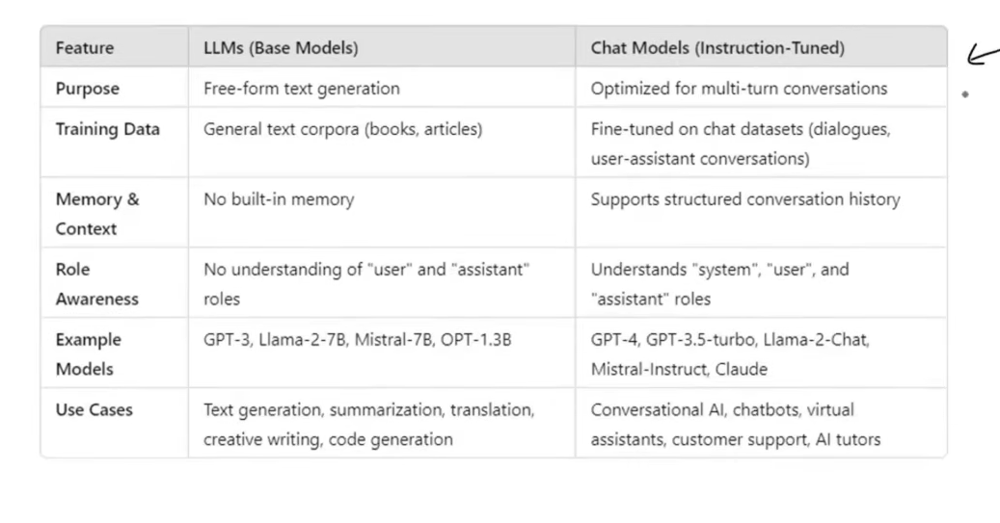
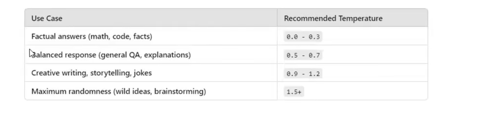

# Models

- Models component in langchain is crucial part of the framework, designed to interact with various language model and embedded models.
  
  
  

## Temperature

**Temperature** is a parameter that controls the randomness of an LLM's output by influencing how it selects the next token during text generation.

- **Temperature = 0**
  - The model selects the highest-probability token at each step, making the output **more deterministic and consistent**.
  - Given the same prompt and settings, the model will usually produce the same response. However, some APIs or models may still introduce slight variations due to implementation details.

- **Low temperature (0.1–0.3)**
  - Produces more accurate, predictable, and focused responses.
  - Best for factual questions, summarization, and code generation.

- **Medium temperature (0.4–0.7)**
  - Balances consistency and creativity.
  - Suitable for general conversations and explanations.

- **High temperature (0.8–1.5)**
  - Produces more diverse, creative, and less predictable responses.
  - Best for storytelling, brainstorming, and creative writing.

