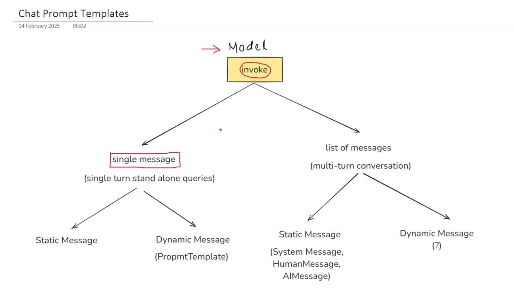

# 2. Prompts

### A. Static prompt and dynamic prompt
#### Static Prompt - static prompt is where is one input field where user write a query after writing query is goes to direct to LLM and it give response and after that response it show the result.
* main thing in this that there is alot of control is in user hand, even a small change can make a very big impact on result.

#### Dynamic Prompt - dynamic prompt is where user give input like [query, type, length] and there is message where we fill these placeholder value and then that message is forwarded to LLM and then LLM give response this is used in recent time.
    
### B. Prompt template

#### Why prompt template over f strings ?? 
* cuz prompt template give default validation, reusable, langchain ecosystem

### dynamic message (?) -> Chat prompt template

# 3. Messages
### types of messages :
* system message
* Human message
* AI message

# 4. Message Placeholder
#### A message placeholder in langchain is a special placeholder used inside a chatpromptTemplate to dynamically insert chat history or a list of message at runtime.