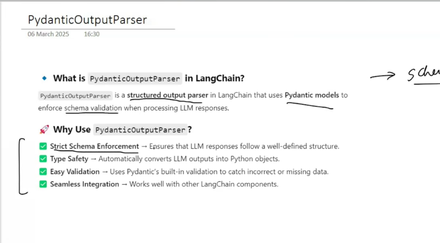

# Output Parsers
### OP in Langchain help convert raw LLM responses into strutured format like JSON, CSV, pydantic models and more.
### thet ensure validation and consistency

## Types of OP
1. String OutputParser
2. JSON OutputParser
3. Structured OutputParser
4. Pydantic OutPut Parser

## StrOutputParser

topic -> LLM -> [Detailed Report] -> LLM -> [5 line summary]

## JSON OutputParser
in this response is recieved in JSON format

## Structured OutputParser
same as strOutputParser but in this we can also provide Schema in this

## Pydantic Output Parser
