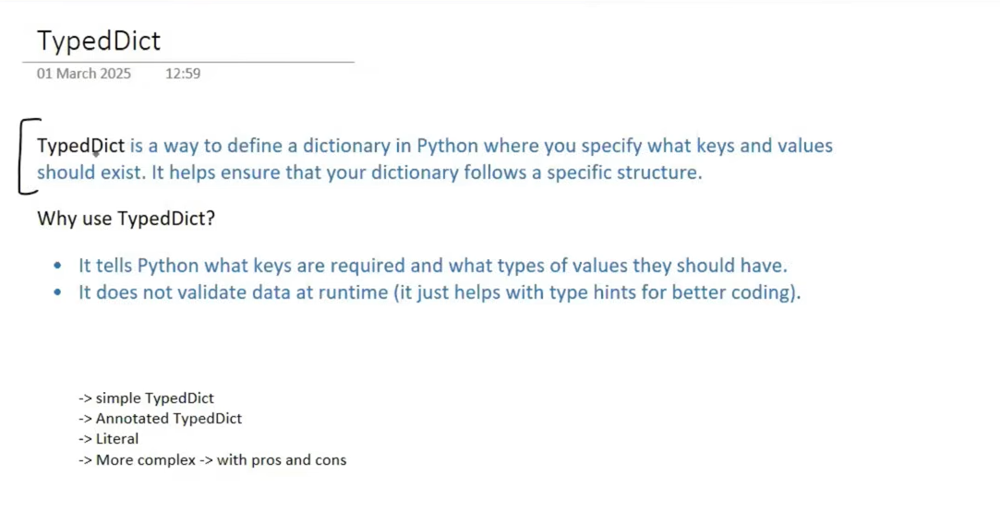
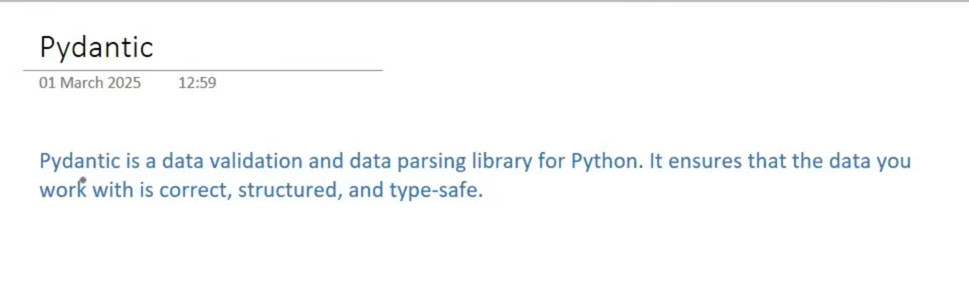

## Why do we need Structured output
* Data extraction 
* API building 
* Agents and any more...
#

# TypedDict

### problem Statement : Reviews -> LLM -> Output{Structured output ({summary: ___, sentiment: ___})}

# Pydantic
