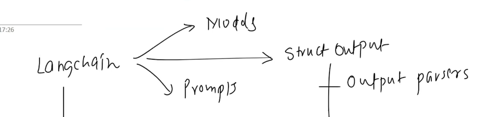

# Recap

# CHAINS
### 1. Simple chain
### 2. Sequential chain
* topic -> LLM -> Report -> LLM -> 5 most important Point
### 3. Parallel chain
* Topic -> model1 -> Notes
        -> model2 -> Quiz
        -> model3 -> combine model1 + model2 (response)
### 4. Conditional chain