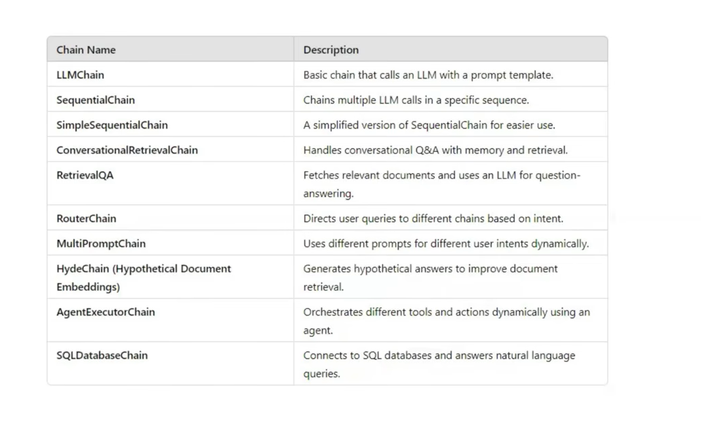
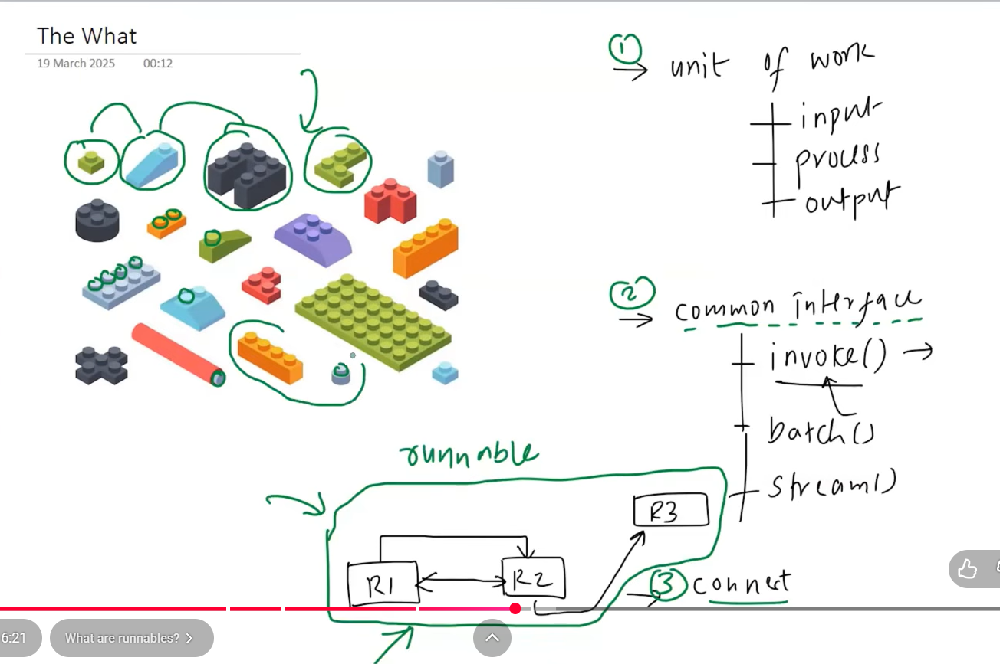
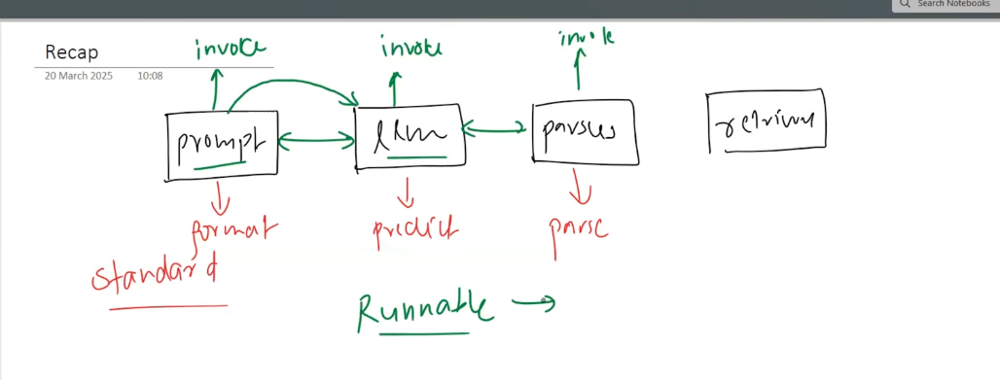
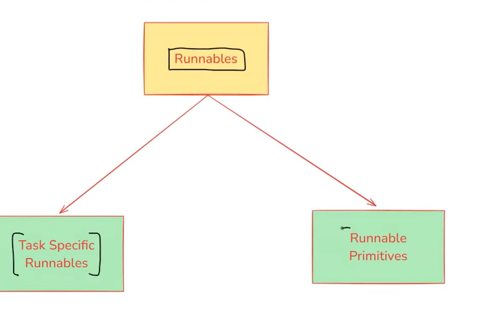
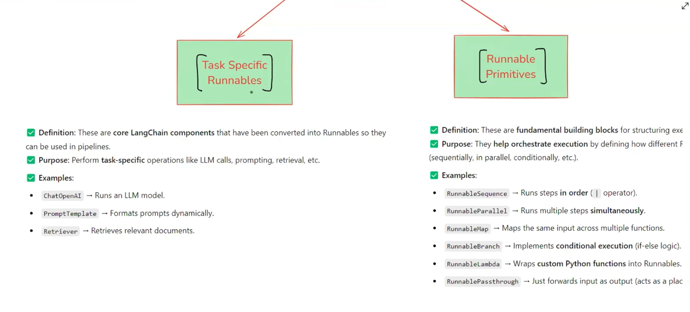

## What is need for runnables

### Lets first understand the problem

* langchain team is seen one thing like they can solve things by automate the main things
* like for each component like 
* for PROMPT, LLM, Parser, RETRIVER they make component for these which automate  things 
* this is done to help engineer
* but after that there is 2 major problem occur
- 1. Large Codebase.
- 2. You can't form chain i.e you cant connect two different componets

* to solve this problem langchain team decide to solve by using proper strandarize way and which connect them runnables.
* you can see to call every component their is one common function .invoke()

* runnables -> abstract class bnayi or sarre componet inherit krrhe the runnable ko.

## Types of Runnables

## LCEL
* a declarative way to create chain using PIPE operator(|)