# RAG
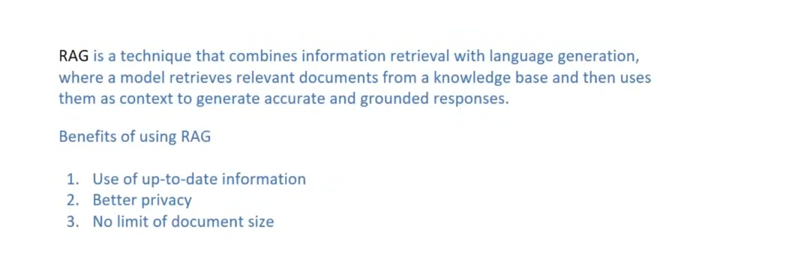

## RAG components
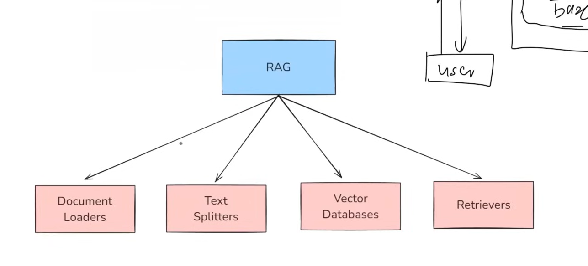

### 1. Documents Loader
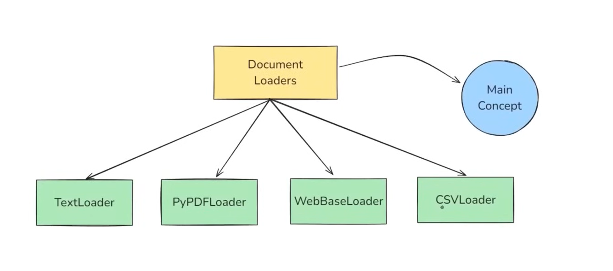
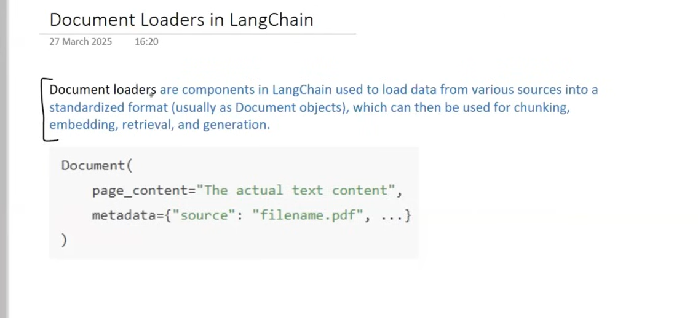  

* #### A. Text Loader
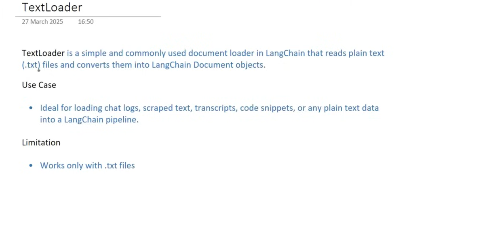

* #### B. PyPDF Loader
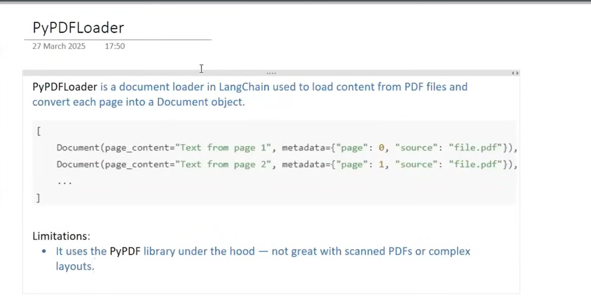
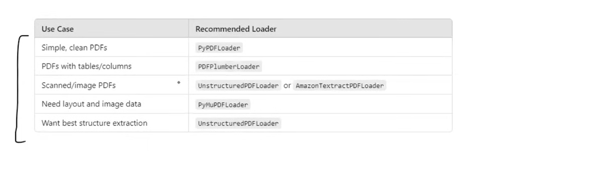

* #### C. Directory Loader
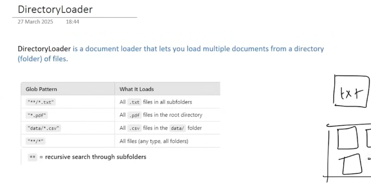
* - Load() vs Lazy load()
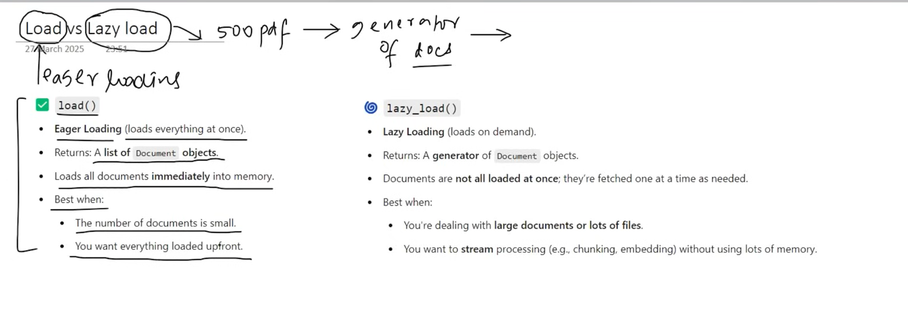 

* #### D. WebBaseLoader
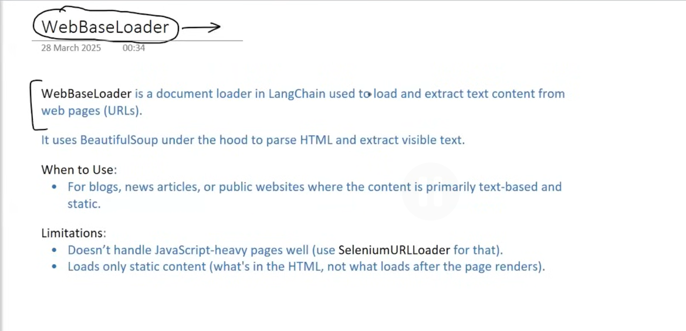

* #### E. CSV Loader
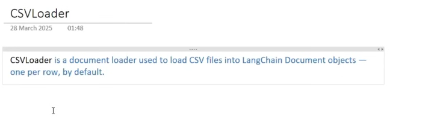

### 2. Text Splitter
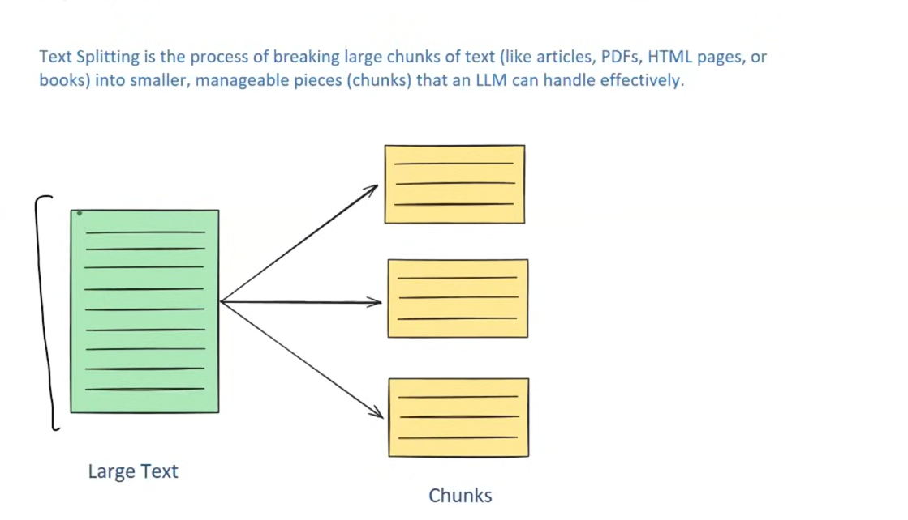
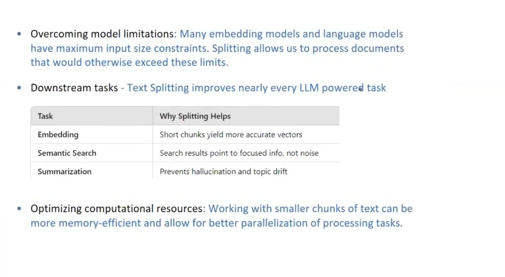
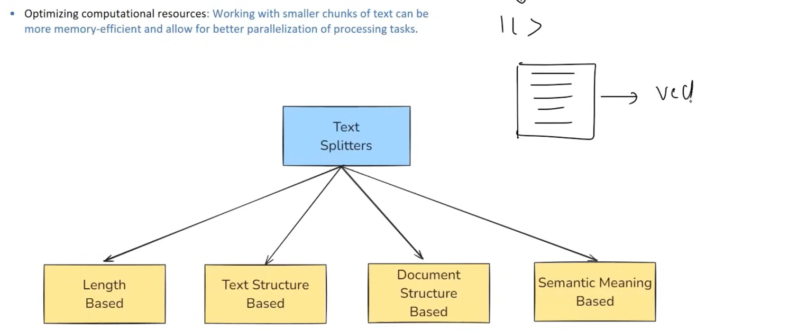

* #### A. Length Based
